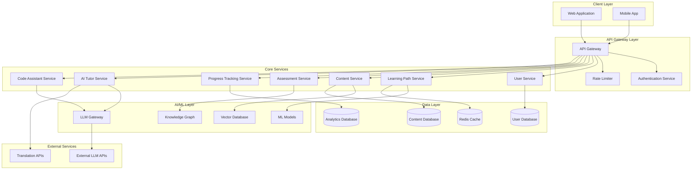
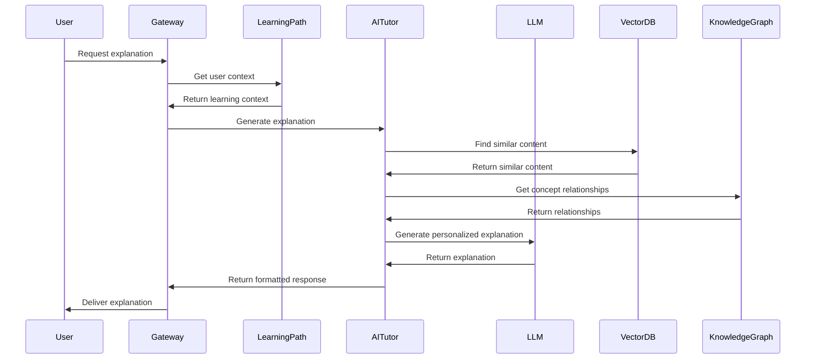

# Design Document: AI-Powered Personalized Learning Platform

## Overview

The AI-powered Personalized Learning and Developer Productivity Platform is designed as a scalable, microservices-based system that leverages Large Language Models (LLMs) and advanced AI techniques to provide personalized educational experiences. The platform adapts to individual learning styles, provides intelligent tutoring, and supports programming education for students across India.

The system employs a hybrid architecture combining vector databases for semantic search, knowledge graphs for structured educational content, and LLM integration for natural language interactions. This approach ensures both scalability and educational effectiveness while maintaining low-bandwidth compatibility for diverse network conditions.

## Architecture

### High-Level Architecture



### Microservices Architecture

The platform follows a microservices architecture pattern with the following key principles:

1. **Service Independence**: Each service can be developed, deployed, and scaled independently
2. **Domain-Driven Design**: Services are organized around business capabilities
3. **API-First Approach**: All services communicate through well-defined APIs
4. **Event-Driven Communication**: Asynchronous communication for non-critical operations
5. **Resilience Patterns**: Circuit breakers, retries, and fallback mechanisms

## Components and Interfaces

### Core Services

#### User Service
**Responsibilities:**
- User registration and authentication
- Profile management and preferences
- Session management and security

**Key Interfaces:**
```typescript
interface UserService {
  registerUser(userData: UserRegistration): Promise<User>
  authenticateUser(credentials: LoginCredentials): Promise<AuthToken>
  updateProfile(userId: string, profile: UserProfile): Promise<User>
  getUserPreferences(userId: string): Promise<UserPreferences>
}

interface UserProfile {
  id: string
  name: string
  email: string
  preferredLanguage: string
  learningGoals: string[]
  knowledgeLevel: KnowledgeLevel
  createdAt: Date
  updatedAt: Date
}
```

#### Learning Path Service
**Responsibilities:**
- Generate personalized learning paths
- Adapt paths based on progress and performance
- Recommend next learning activities

**Key Interfaces:**
```typescript
interface LearningPathService {
  generateLearningPath(userId: string, subject: string): Promise<LearningPath>
  updatePathProgress(userId: string, activityId: string, result: ActivityResult): Promise<void>
  getNextActivity(userId: string, pathId: string): Promise<LearningActivity>
  adaptPath(userId: string, pathId: string, performance: PerformanceData): Promise<LearningPath>
}

interface LearningPath {
  id: string
  userId: string
  subject: string
  activities: LearningActivity[]
  currentPosition: number
  estimatedCompletion: Date
  adaptationHistory: PathAdaptation[]
}
```

#### AI Tutor Service
**Responsibilities:**
- Generate explanations and educational content
- Provide interactive tutoring sessions
- Adapt explanations to user's knowledge level

**Key Interfaces:**
```typescript
interface AITutorService {
  explainConcept(concept: string, userLevel: KnowledgeLevel, language: string): Promise<Explanation>
  answerQuestion(question: string, context: LearningContext): Promise<Answer>
  generateExamples(concept: string, difficulty: DifficultyLevel): Promise<Example[]>
  provideFeedback(userResponse: string, expectedAnswer: string): Promise<Feedback>
}

interface Explanation {
  concept: string
  content: string
  examples: Example[]
  relatedConcepts: string[]
  difficulty: DifficultyLevel
  language: string
}
```

#### Code Assistant Service
**Responsibilities:**
- Analyze and debug code
- Provide programming guidance
- Generate code examples and explanations

**Key Interfaces:**
```typescript
interface CodeAssistantService {
  analyzeCode(code: string, language: ProgrammingLanguage): Promise<CodeAnalysis>
  debugCode(code: string, error: string): Promise<DebuggingHelp>
  explainCode(code: string, language: ProgrammingLanguage): Promise<CodeExplanation>
  generateExample(concept: string, language: ProgrammingLanguage): Promise<CodeExample>
}

interface CodeAnalysis {
  errors: CodeError[]
  warnings: CodeWarning[]
  suggestions: CodeSuggestion[]
  qualityScore: number
  complexity: ComplexityMetrics
}
```

#### Assessment Service
**Responsibilities:**
- Generate and manage assessments
- Evaluate student responses
- Provide detailed feedback and analytics

**Key Interfaces:**
```typescript
interface AssessmentService {
  generateQuiz(topic: string, difficulty: DifficultyLevel, count: number): Promise<Quiz>
  evaluateResponse(questionId: string, userResponse: string): Promise<EvaluationResult>
  getPerformanceAnalytics(userId: string, timeframe: TimeFrame): Promise<PerformanceAnalytics>
  generateCodingChallenge(skill: string, difficulty: DifficultyLevel): Promise<CodingChallenge>
}

interface Quiz {
  id: string
  topic: string
  questions: Question[]
  timeLimit: number
  difficulty: DifficultyLevel
  passingScore: number
}
```

### AI/ML Integration Layer

#### LLM Gateway
**Responsibilities:**
- Manage connections to external LLM APIs
- Handle prompt engineering and response processing
- Implement caching and rate limiting for LLM calls

**Architecture Pattern:**
```typescript
interface LLMGateway {
  generateResponse(prompt: string, model: LLMModel, parameters: LLMParameters): Promise<LLMResponse>
  embedText(text: string): Promise<number[]>
  translateText(text: string, targetLanguage: string): Promise<string>
}

interface LLMParameters {
  temperature: number
  maxTokens: number
  topP: number
  frequencyPenalty: number
  presencePenalty: number
}
```

#### Vector Database Integration
**Purpose:** Enable semantic search and content similarity matching
**Technology:** Pinecone, Weaviate, or Chroma for vector storage
**Use Cases:**
- Finding similar learning content
- Semantic search across educational materials
- Content recommendation based on user interests

#### Knowledge Graph
**Purpose:** Represent structured relationships between educational concepts
**Technology:** Neo4j or Amazon Neptune
**Structure:**
```cypher
// Example knowledge graph structure
(Concept)-[:PREREQUISITE]->(Concept)
(Concept)-[:RELATED_TO]->(Concept)
(User)-[:KNOWS]->(Concept)
(User)-[:LEARNING]->(Concept)
(Content)-[:TEACHES]->(Concept)
```

## Data Models

### Core Data Models

#### User and Profile Models
```typescript
interface User {
  id: string
  email: string
  passwordHash: string
  profile: UserProfile
  preferences: UserPreferences
  createdAt: Date
  updatedAt: Date
  lastLoginAt: Date
}

interface UserPreferences {
  preferredLanguage: string
  learningStyle: LearningStyle
  difficultyPreference: DifficultyLevel
  notificationSettings: NotificationSettings
  accessibilitySettings: AccessibilitySettings
}

enum LearningStyle {
  VISUAL = "visual",
  AUDITORY = "auditory",
  KINESTHETIC = "kinesthetic",
  READING_WRITING = "reading_writing"
}
```

#### Learning and Content Models
```typescript
interface LearningActivity {
  id: string
  type: ActivityType
  title: string
  description: string
  content: ActivityContent
  prerequisites: string[]
  estimatedDuration: number
  difficulty: DifficultyLevel
  tags: string[]
}

interface ActivityContent {
  text?: string
  multimedia?: MultimediaContent[]
  interactiveElements?: InteractiveElement[]
  codeExamples?: CodeExample[]
}

interface MultimediaContent {
  type: MediaType
  url: string
  caption?: string
  transcript?: string
}

enum ActivityType {
  LESSON = "lesson",
  QUIZ = "quiz",
  CODING_EXERCISE = "coding_exercise",
  PROJECT = "project",
  DISCUSSION = "discussion"
}
```

#### Assessment and Progress Models
```typescript
interface AssessmentResult {
  id: string
  userId: string
  assessmentId: string
  responses: QuestionResponse[]
  score: number
  completedAt: Date
  timeSpent: number
  feedback: AssessmentFeedback
}

interface ProgressRecord {
  id: string
  userId: string
  activityId: string
  status: ProgressStatus
  startedAt: Date
  completedAt?: Date
  attempts: number
  bestScore?: number
  timeSpent: number
}

enum ProgressStatus {
  NOT_STARTED = "not_started",
  IN_PROGRESS = "in_progress",
  COMPLETED = "completed",
  MASTERED = "mastered"
}
```

### Data Flow Architecture



Now I need to use the prework tool to analyze the acceptance criteria before writing the Correctness Properties section:

<function_calls>
<invoke name="prework">
<parameter name="featureName">ai-learning-platform

## Correctness Properties

*A property is a characteristic or behavior that should hold true across all valid executions of a system—essentially, a formal statement about what the system should do. Properties serve as the bridge between human-readable specifications and machine-verifiable correctness guarantees.*

Based on the requirements analysis, the following correctness properties ensure the system behaves correctly across all valid inputs and scenarios:

### Property 1: Learning Path Generation and Adaptation
*For any* new student registration, the system should trigger an initial assessment, generate a personalized learning path based on the results, and continuously adapt the path as the student completes activities and demonstrates progress or difficulty.
**Validates: Requirements 1.1, 1.2, 1.3, 1.4, 1.5**

### Property 2: AI Tutor Explanation Quality and Adaptation  
*For any* concept explanation request, the AI tutor should provide clear explanations adapted to the student's knowledge level, include relevant examples and analogies, and offer alternative explanations when the student indicates confusion.
**Validates: Requirements 2.1, 2.2, 2.3, 2.5**

### Property 3: Language Consistency and Support
*For any* student with a preferred regional language, all content and explanations should be delivered consistently in that language, with technical terms handled appropriately when direct translations don't exist.
**Validates: Requirements 2.4, 6.1, 6.2, 6.4, 6.5**

### Property 4: Code Assistant Comprehensive Help
*For any* code submission or programming help request, the code assistant should identify errors with clear explanations, suggest specific fixes, provide step-by-step guidance with examples, and support all specified programming languages (Java, Python, HTML, CSS, JavaScript).
**Validates: Requirements 3.1, 3.2, 3.3, 3.4, 3.5**

### Property 5: Assessment Generation and Feedback
*For any* completed learning module or assessment, the system should generate appropriate practice questions or quizzes based on the student's knowledge level, provide immediate feedback, and offer detailed explanations for incorrect answers.
**Validates: Requirements 4.1, 4.2, 4.3, 4.5**

### Property 6: Progressive Difficulty in Coding Challenges
*For any* sequence of coding challenges, the difficulty should increase progressively, ensuring a smooth learning curve for students.
**Validates: Requirements 4.4**

### Property 7: Comprehensive Progress Tracking
*For any* learning activity completion, the system should record performance data, update progress metrics, generate visual dashboards, identify learning patterns, and provide detailed analytics upon request.
**Validates: Requirements 5.1, 5.2, 5.3, 5.5**

### Property 8: Progress Report Generation
*For any* periodic report generation trigger, the system should create progress reports containing recommendations for improvement based on the student's learning data.
**Validates: Requirements 5.4**

### Property 9: Secure Authentication and Session Management
*For any* user registration or login attempt, the system should create secure accounts with encrypted passwords, authenticate credentials securely, and manage sessions with automatic timeout for inactive users.
**Validates: Requirements 7.1, 7.3, 7.4**

### Property 10: Profile Management Functionality
*For any* profile update request, the system should allow students to modify their information, preferences, and learning goals, with changes persisted correctly.
**Validates: Requirements 7.2**

### Property 11: Data Deletion and Privacy
*For any* account deletion request, the system should securely remove all personal data while preserving anonymized analytics for system improvement.
**Validates: Requirements 7.5**

### Property 12: Performance Response Times
*For any* student request under normal load conditions, the system should respond within 3 seconds to maintain a responsive user experience.
**Validates: Requirements 8.1**

### Property 13: Low-Bandwidth Optimization
*For any* content delivery request in low-bandwidth environments, the system should optimize content to ensure effective delivery without compromising educational value.
**Validates: Requirements 8.3**

### Property 14: Data Security and Encryption
*For any* personal data storage or transmission, the system should apply appropriate encryption both at rest and in transit to protect user privacy.
**Validates: Requirements 9.1**

### Property 15: Data Consent and Control
*For any* data collection scenario, the system should obtain explicit user consent, clearly explain data usage, and provide users with control over their data including export and deletion capabilities.
**Validates: Requirements 9.3, 9.4**

### Property 16: Role-Based Access Control
*For any* attempt to access user data, the system should enforce role-based access controls to ensure only authorized personnel can access sensitive information.
**Validates: Requirements 9.5**

### Property 17: Content Validation and Error Reporting
*For any* educational content delivery, the system should validate content accuracy before delivery and provide mechanisms for students to report errors or inaccuracies.
**Validates: Requirements 10.1, 10.3**

### Property 18: Translation Quality Maintenance
*For any* content translation between languages, the system should maintain technical accuracy and contextual appropriateness to ensure educational effectiveness.
**Validates: Requirements 6.3**

## Error Handling

The system implements comprehensive error handling strategies across all components:

### LLM Integration Error Handling
- **Timeout Management**: Implement circuit breakers for LLM API calls with fallback to cached responses
- **Rate Limit Handling**: Queue requests and implement exponential backoff when rate limits are exceeded
- **Content Filtering**: Validate LLM responses for appropriateness and accuracy before delivery
- **Fallback Mechanisms**: Provide pre-generated content when LLM services are unavailable

### Data Consistency and Recovery
- **Transaction Management**: Use database transactions for critical operations like user registration and progress updates
- **Data Validation**: Implement input validation at API boundaries and before database operations
- **Backup and Recovery**: Automated backups with point-in-time recovery capabilities
- **Conflict Resolution**: Handle concurrent updates to user progress and learning paths

### Network and Infrastructure Resilience
- **Retry Logic**: Implement exponential backoff for transient failures
- **Health Checks**: Monitor service health and automatically route traffic away from unhealthy instances
- **Graceful Degradation**: Provide limited functionality when dependent services are unavailable
- **Load Balancing**: Distribute traffic across multiple instances to prevent overload

### User Experience Error Handling
- **Informative Error Messages**: Provide clear, actionable error messages in the user's preferred language
- **Progressive Enhancement**: Ensure core functionality works even when advanced features fail
- **Offline Capabilities**: Cache essential content for offline access in low-connectivity scenarios
- **Error Recovery**: Allow users to retry failed operations with improved success rates

## Testing Strategy

The testing strategy employs a dual approach combining unit tests for specific scenarios and property-based tests for comprehensive coverage:

### Unit Testing Approach
Unit tests focus on:
- **Specific Examples**: Test concrete scenarios like user registration with valid data
- **Edge Cases**: Test boundary conditions such as empty inputs, maximum length strings, and invalid data formats  
- **Integration Points**: Test interactions between services, especially authentication flows and data synchronization
- **Error Conditions**: Test specific error scenarios like network timeouts, invalid credentials, and malformed requests

### Property-Based Testing Approach
Property-based tests validate universal properties across randomized inputs:
- **Minimum 100 iterations** per property test to ensure comprehensive coverage
- **Randomized Test Data**: Generate diverse user profiles, learning content, and interaction patterns
- **Invariant Validation**: Ensure system properties hold regardless of input variations
- **Cross-Service Consistency**: Validate that data remains consistent across service boundaries

### Property Test Configuration
Each property-based test will:
- Reference its corresponding design document property
- Use the tag format: **Feature: ai-learning-platform, Property {number}: {property_text}**
- Generate realistic test data that reflects actual usage patterns
- Validate both functional correctness and performance characteristics

### Testing Technology Stack
- **Unit Testing**: Jest (JavaScript/TypeScript), pytest (Python), JUnit (Java)
- **Property-Based Testing**: fast-check (JavaScript/TypeScript), Hypothesis (Python), QuickCheck (Java)
- **Integration Testing**: Testcontainers for database and external service testing
- **Load Testing**: Artillery or k6 for performance validation
- **End-to-End Testing**: Playwright for user journey validation

### Test Data Management
- **Synthetic Data Generation**: Create realistic but anonymized test data
- **Test Environment Isolation**: Separate test databases and external service mocks
- **Data Privacy**: Ensure no real user data is used in testing environments
- **Reproducible Tests**: Use seeded random generators for consistent test results

The comprehensive testing strategy ensures both correctness and reliability while maintaining the educational effectiveness that is central to the platform's mission.
